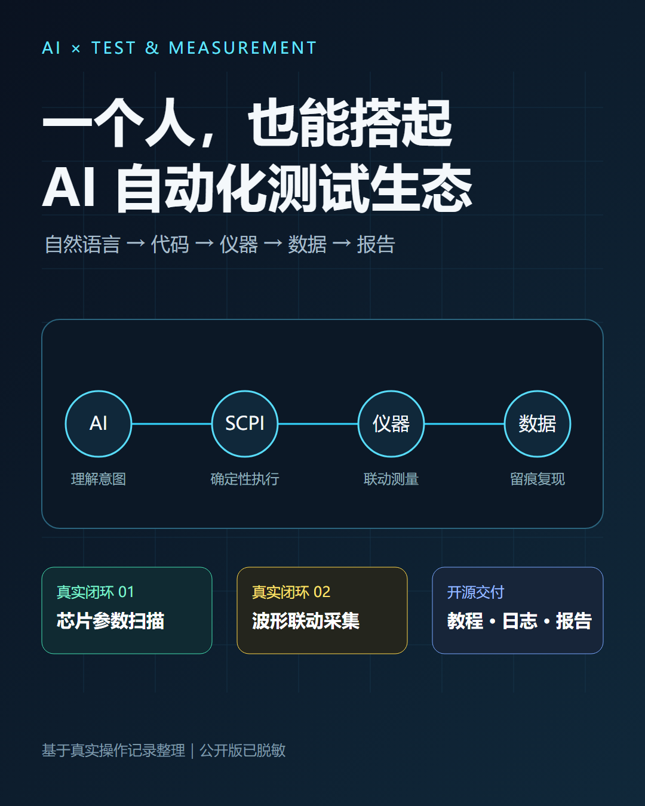
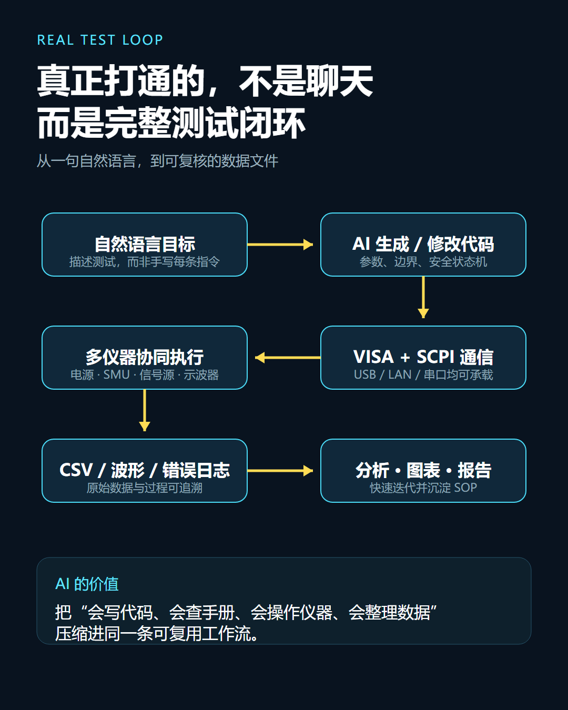
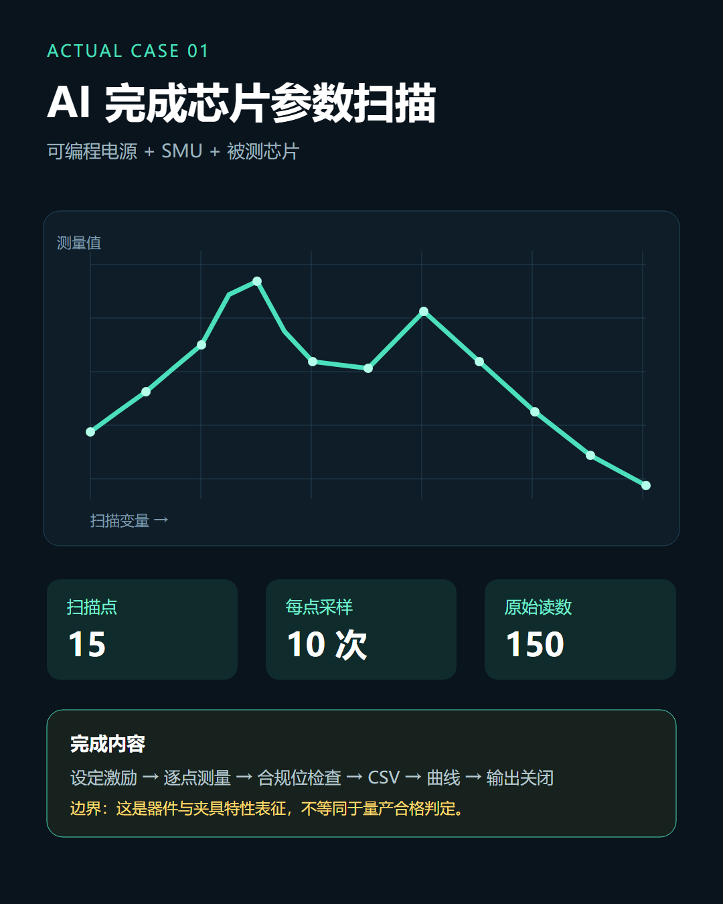
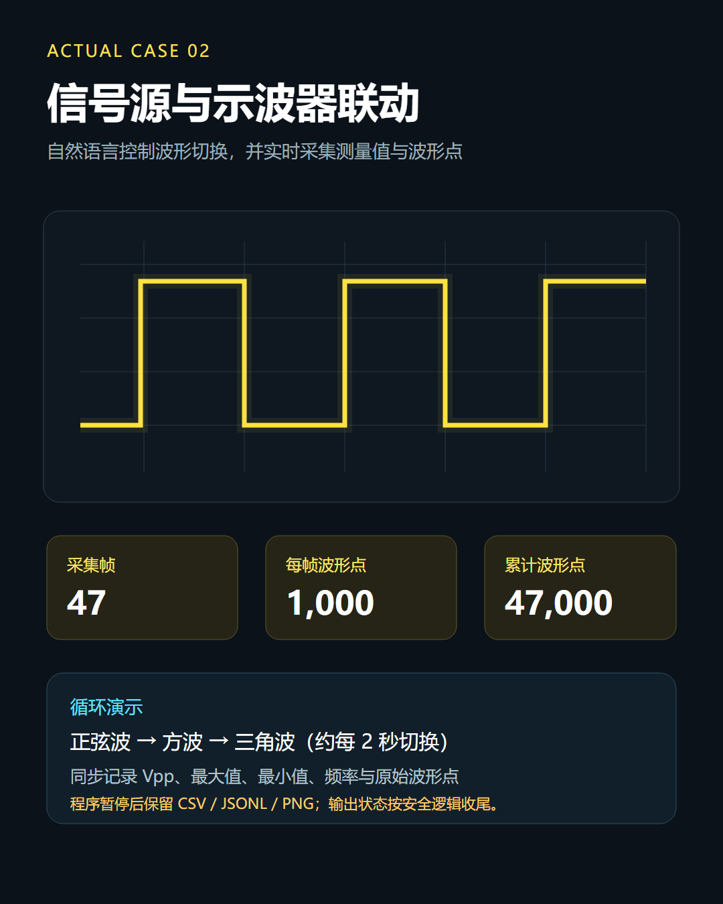
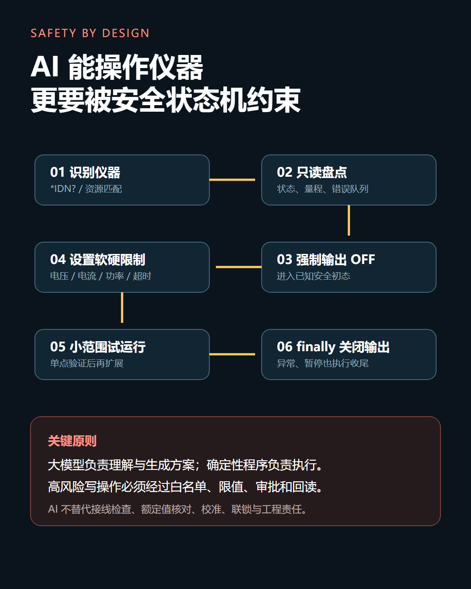
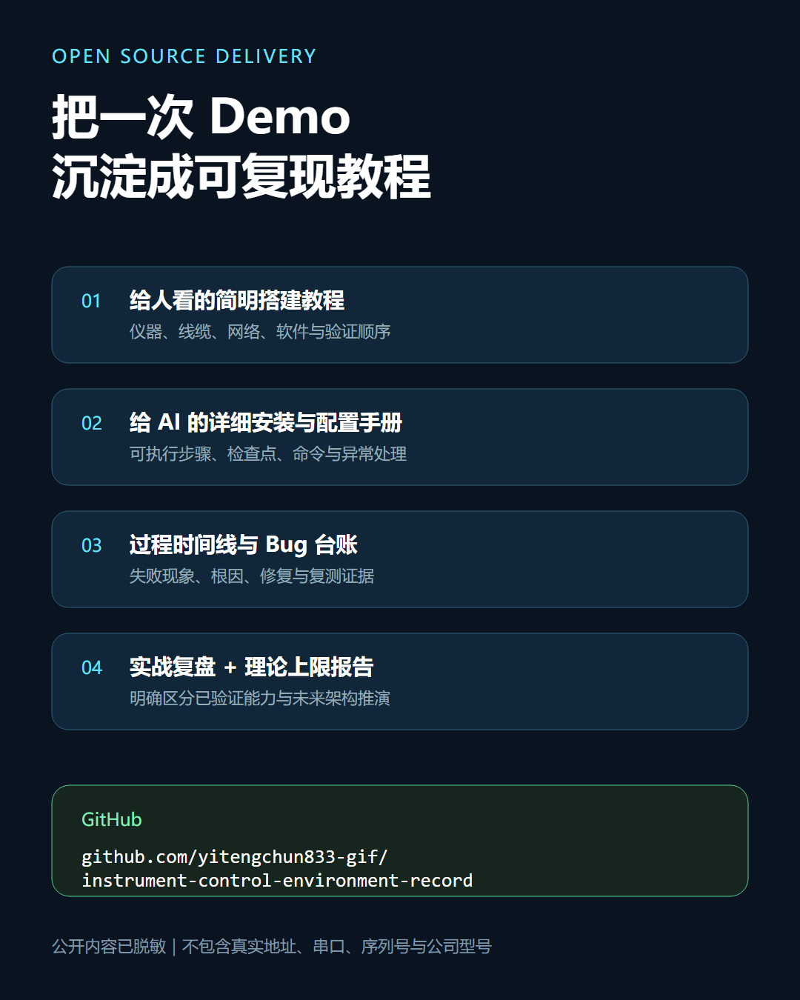
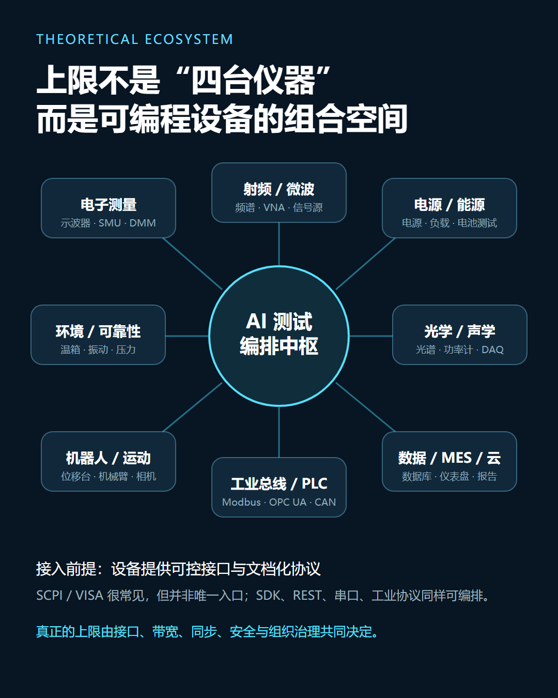
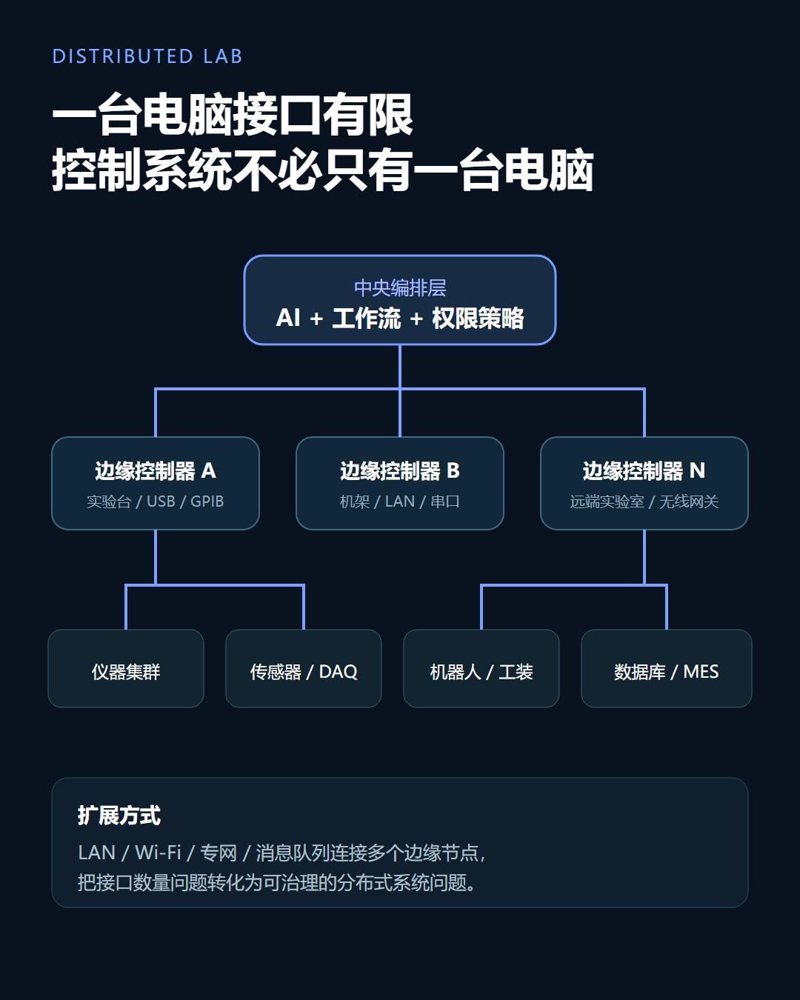
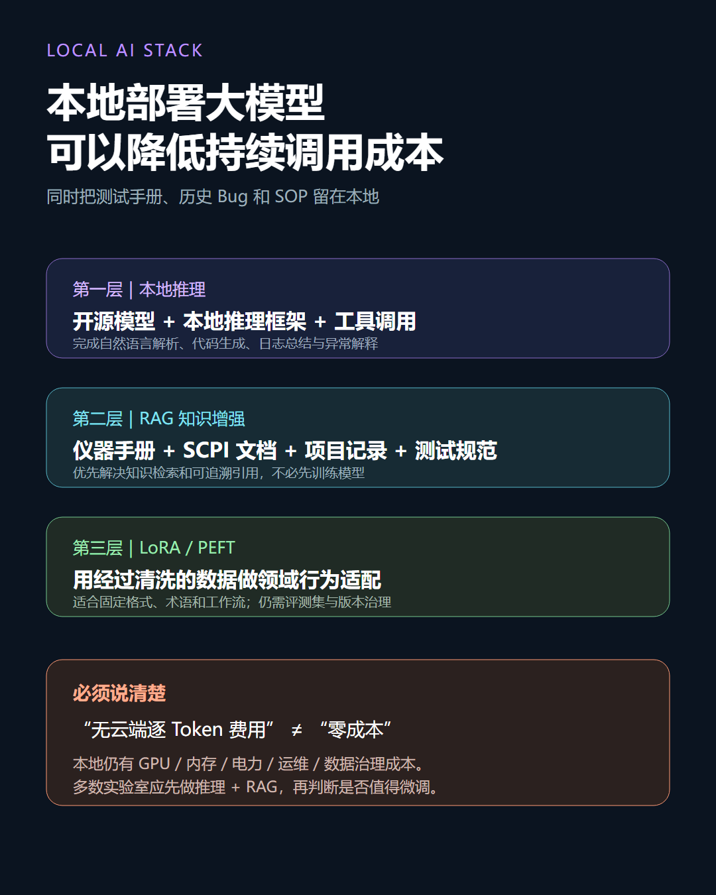
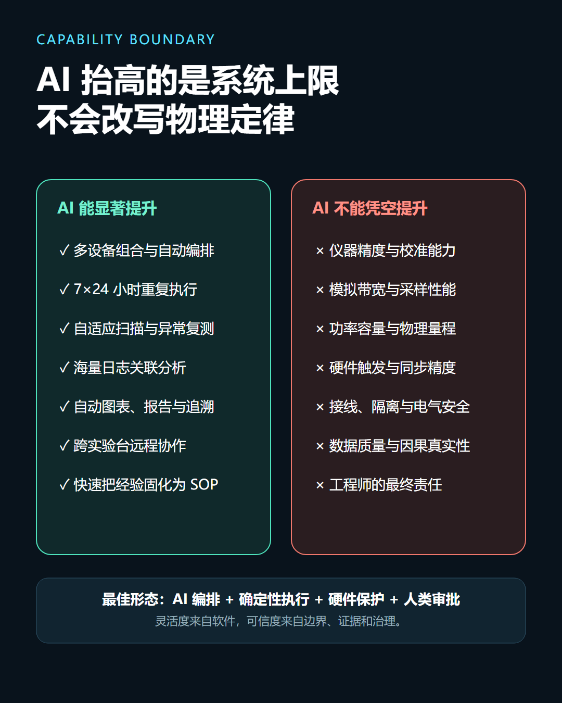

# AI 仪器自动化社交平台发布文案与配图脚本

**开源教程与完整报告：**  
<https://github.com/yitengchun833-gif/instrument-control-environment-record>

本文提供两篇可以分别发布的正文、一版短文、标题备选、配图顺序和视频口播。发布时不要把实测成果与理论推演合并成一个未经说明的结论。

---

## 发布一：真实测试复盘

### 推荐标题

**我用 AI 联动四类实验室仪器，完成了两套真实自动化测试闭环**

### 可直接发布的正文

最近我尝试了一件很实际的事：不先开发一套固定上位机，而是直接用自然语言告诉 AI 我要完成什么测试，让 AI 协助阅读仪器手册、诊断通信环境、编写 Python 程序、分析数据并整理结果。

最终，我用一台普通 Windows 电脑真实联动了四类仪器：程控电源、SMU、信号发生器和示波器。

第一套任务是芯片导通电阻平坦度测试。程控电源负责供电和输入偏置扫描，SMU 输出 1 mA 测试电流并通过四线 Remote Sense 测量压降。整个过程包含 15 个偏置点，每点 10 次原始读数，共 150 次测量，同时记录电流、压降、状态字和仪器输出状态。测试结束后，程序再次确认所有相关输出均已关闭。

第二套任务是信号源和示波器联动。信号发生器循环切换正弦波、方波和三角波，示波器实时读取 Vpp、最大值、最小值和频率。最终保存了 47 帧波形，每帧 1000 点，共 47,000 个波形点，同时生成参数 CSV、逐点波形数据、无损记录和实时波形图。

AI 在这次任务中完成的，不只是生成几条 SCPI 指令。它参与了仪器资料理解、VISA/串口/USBTMC/LAN 环境排查、控制程序修改、安全逻辑设计、日志分析、绘图和报告整理。

但真实仪器动作不是由一个没有边界的聊天模型直接执行。程序使用了命令白名单、输出状态回读、限值、稳定检查、compliance 检测、异常中止和最终关断。AI 负责理解、编排和分析，确定性 Python/VISA/SCPI 程序负责安全执行。

这次实践让我确认了一件事：AI 不会提高示波器带宽或 SMU 精度，也不能替代接线和安全判断；但它可以明显降低多仪器自动化的资料理解、编程、调试和数据处理门槛。过去需要分别编写多套上位机、反复查手册和手工整理数据的任务，现在可以由一个工程师更快地完成闭环。

我已经把脱敏后的环境搭建教程、AI 执行手册、Bug 台账和两份报告整理到了 GitHub：

<https://github.com/yitengchun833-gif/instrument-control-environment-record>

其中没有保留被测芯片型号、仪器地址、设备序列号或本机路径。教程也不会让读者直接照抄输出参数，而是要求从设备识别、资源发现、身份查询和只读状态开始逐级验证。

这还只是一个个人化原型，但它已经证明：一台电脑、几台基础仪器和 AI，可以组成一套低成本、高灵活度、可持续扩展的测试工作流。

### 推荐标签

`#AI硬件` `#自动化测试` `#测试测量` `#Python` `#PyVISA` `#SCPI` `#示波器` `#实验室自动化`

---

## 发布二：理论上限与未来架构

### 推荐标题

**AI 仪器控制的真正上限，不是四台设备，而是一座软件定义实验室**

### 发布前声明

> 以下内容是基于真实四仪器闭环、官方协议标准和开源项目进行的架构推演。除已经列明的程控电源、SMU、信号发生器和示波器外，其他设备尚未在本项目中逐项接入验证。

### 可直接发布的正文

完成四类仪器联动后，我重新思考了一个问题：AI 测试生态的上限到底在哪里？

答案并不是“电脑还能插多少个 USB 口”，也不是“支持多少台 SCPI 仪器”。

更准确的边界是：所有能够被软件可靠寻址、读取、控制并回读状态的设备，都可以成为 AI 测试编排系统的节点。

除了示波器、信号源、电源、SMU、数字万用表、电子负载和频谱仪，还可以继续接入半导体参数分析仪、探针台、温湿度箱、振动台、光谱仪、机器视觉、机械臂、PLC、CAN 总线设备、HIL、实验室机器人以及 LIMS、ELN、MES 等系统。

它们也不必全部使用 VISA/SCPI。测试测量设备可以使用 VISA、SCPI、USBTMC、LXI、VXI-11 和 HiSLIP；工业设备可以使用 OPC UA、Modbus、EtherCAT、CAN；实验室设备可以使用 SiLA 2 和 OPC UA LADS；机器人可以使用 ROS 2 或厂商 SDK；软件系统可以使用 REST、gRPC、MQTT、数据库和 MCP。

老设备没有网络接口怎么办？可以在设备旁部署工控机、单板机、串口服务器、数据采集卡或微控制器，把本地设备能力封装成受控 API。主电脑不需要直接连接所有设备，只负责测试任务、权限和数据汇总，各边缘控制器在本地完成确定性动作。

理论架构可以简化为：

```text
自然语言和测试目标
        ↓
AI 编排与数据分析
        ↓
权限、审批、白名单和仿真
        ↓
确定性测试工作流
        ↓
边缘控制器、PLC 和协议网关
        ↓
仪器、传感器、机器人和测试站
        ↓
数据库、LIMS、ELN、MES 和报告系统
```

在这种结构下，一个工程师可以管理高维条件扫描、跨设备闭环、无人值守长测、自适应采样、多个测试站和自动追溯。AI 的优势不是突破仪器物理性能，而是把原来需要多人、多套软件和大量重复劳动的工作组织起来。

AI 层还可以本地部署。使用开源权重大模型和本地推理引擎后，不再产生云端 API 的逐 Token 费用，也可以在隔离网络运行。更现实的路线不是从零训练基础大模型，而是“本地推理 + 仪器手册与日志 RAG + 必要时 LoRA 微调”。

需要强调：无云端 Token 费用不等于完全零成本。本地方案仍然需要计算硬件、电力、散热、存储、模型许可证、数据治理和维护。AI 也不能代替硬件联锁、功能安全、校准、测量不确定度和最终工程责任。

所以，这套生态真正的上限由仪器能力、接口质量、网络与同步、夹具、校准、安全体系、模型能力和运维水平共同决定。四台仪器只是最小验证节点，终点可以是一座分布式、可审计的软件定义实验室。

完整架构报告、真实测试复盘和环境搭建教程已经开源：

<https://github.com/yitengchun833-gif/instrument-control-environment-record>

### 推荐标签

`#AI实验室` `#工业自动化` `#测试测量` `#边缘计算` `#本地大模型` `#SCPI` `#OPCUA` `#机器人`

---

## 短版发布文案

### 适合朋友圈、动态或视频简介

我用一台 Windows 电脑和 AI，真实联动了程控电源、SMU、信号发生器和示波器，完成了芯片导通电阻平坦度测试，以及波形切换、示波器参数监控和 47,000 个波形点采集。

AI 负责理解手册、修改代码、分析日志和生成报告，真正的仪器动作仍由带白名单、回读、限值和异常关断的 Python/VISA/SCPI 程序执行。

这套方法还可以扩展到电子负载、频谱仪、温箱、PLC、机器人和实验室信息系统。通过边缘网关，一台主控电脑不受 USB 接口数量直接限制；通过本地大模型，还能取消云端 API 的逐 Token 费用，但仍需承担硬件、电力和维护成本。

脱敏教程与完整报告：  
<https://github.com/yitengchun833-gif/instrument-control-environment-record>

---

## 标题备选

### 偏实测

1. 一个人如何用 AI 完成两套真实仪器自动化测试
2. 从自然语言到示波器波形：我的 AI 仪器控制实测
3. AI + Python + VISA：四类仪器联动实战
4. 不先开发上位机，我用 AI 跑通了多仪器测试闭环

### 偏架构

1. AI 测试生态的上限到底在哪里？
2. 从四台仪器到分布式实验室：AI 如何编排真实设备
3. SCPI 只是起点：AI 可以连接哪些实验室和工业设备
4. 本地大模型 + 边缘控制器：低成本软件定义实验室构想

---

## 已完成配图

配图采用 1080×1350（4:5）原创矢量技术卡片，不使用实物照片、厂商 Logo 或网络转载图片。SVG 为可编辑母版，PNG 为直接发布版本。

### 实测篇：建议顺序













### 理论篇：建议顺序










若平台一次只能发九张图，实测篇使用 01–05 和 10；理论篇使用 01、06–10。视频负责展示真实仪器和动态过程，图卡负责解释链路、数据、边界与复现入口。

---

## 90 秒视频口播

> 我这次用一台普通 Windows 电脑和 AI，真实连接了四类实验室仪器：程控电源、SMU、信号发生器和示波器。
>
> 第一套任务是芯片导通电阻平坦度测试。电源负责供电和偏置扫描，SMU 负责四线测量。程序完成了 15 个偏置点、150 次原始读数，并在结束后确认所有输出关闭。
>
> 第二套任务是让信号源循环切换正弦波、方波和三角波，示波器实时读取 Vpp、最大值、最小值和频率。最终保存了 47 帧、总计 47,000 个波形点。
>
> AI 不只是发 SCPI 指令。它帮我查手册、排查 VISA、串口、USB 和网络环境，修改程序、分析日志并生成报告。但真正控制仪器的是带白名单、回读、限值和异常关断的确定性程序。
>
> 四台仪器也不是理论上限。未来可以通过不同协议和边缘网关接入电子负载、频谱仪、温箱、PLC、机器人甚至 LIMS 和 MES。本地部署开源大模型后，还可以避免云端逐 Token 费用，但硬件和维护成本仍然存在。
>
> 我已经把脱敏后的环境教程、Bug 台账和完整报告上传到 GitHub，链接在简介中。

---

## 发布前隐私检查

- 被测芯片型号、PCB 丝印、公司项目名；
- 仪器序列号、IP、COM 号和 VISA 资源；
- Windows 用户名、本地绝对路径和终端历史；
- 浏览器标签、聊天侧栏、通知和账号头像；
- API Key、Token、Cookie、二维码和登录信息；
- 未公开的数据手册、测试标准、客户或供应商资料；
- 照片和视频背景中的标签、工牌、快递单和白板内容。

发布前还应确认仪器照片中的序列号贴纸、示波器截图上的网络信息以及录屏终端中的历史命令已经遮挡。
